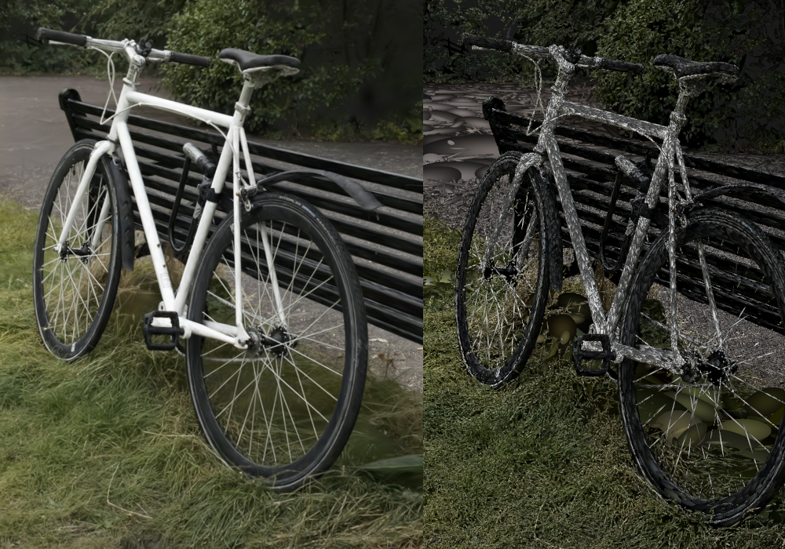

# 3d Gaussian Splatting Renderer 

Final project for the course TDT4230 - Graphics and Visualization.

Project extends the base code provided, see `https://github.com/bartvbl/TDT4230-Assignment-1.git`.

## Install

	git clone --recursive git@github.com:LytixDev/3d-gaussian-splatting.git

Should you forget the `--recursive` bit, just run:

	git submodule update --init

### Linux:

Make sure you have a C++ compiler such as GCC, CMake, and Git.

	make run

which is equivalent to

	git submodule update --init
	cd build
	cmake ..
	make
	./glowbox

### Windows
Not tested, but may work using MSVC and CMake
